# Cerebral Cipher: a logic puzzle game

'Cerebral Cipher' is a site that hosts a small logic puzzle game played against the computer, based on the popular physical boardgame 'Mastermind'. 

## Requirement Gathering and Planning

Before starting this project, I took some time to think about how to set up, lay out and develop this game. I wrote a few user stories and extracted the user needs from them as well. These needs will also help in my manual testing. For my technical preparation, I considered which functions I will require, as well as the potential way to organise my HTML IDs for styling use with my CSS.

### User Stories

**As a** player \
**I want** a game that is clearly laid out and intuitive\
**So that** I can easily understand how to play it and find all the parts I need

**As a** player \
**I want** to control my guess input\
**So that** I am not stuck with the first four guesses I put in, should I change my mind

**As a** player \
**I want** to be given enough chances to make my guess and learn from the feedback \
**So that** the game is satisfying and gives me adequate chance to win, without letting me go on infinitely

**As a** player \
**I want** to be able to refer to the rules \
**So that** I can look at them at any point during the game to remind myself of anything I've forgotten

**As a** player \
**I want** to be able to play more than one game \
**So that** I can play the number of games I desire

### User Needs

- A clear and intuitive lay out
- Controls to amend the existing guesses prior to submission 
- A good number of rounds in each game
- Feedback on my guesses
- A rulebook
- A clear end game phase
- A method of starting a new game

### Process Flowchart

I created this flowchart to visualise the processes in the game and where the user inputs were.

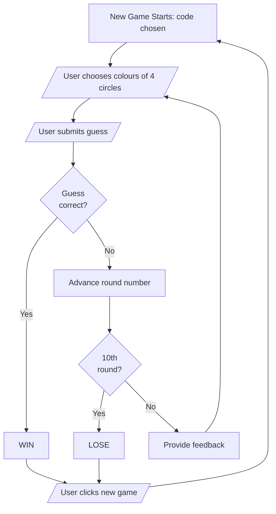

## Design

### Wireframes

With my list of requirements, I created two wireframes. One for the mobile version and one for the tablet/desktop version. 

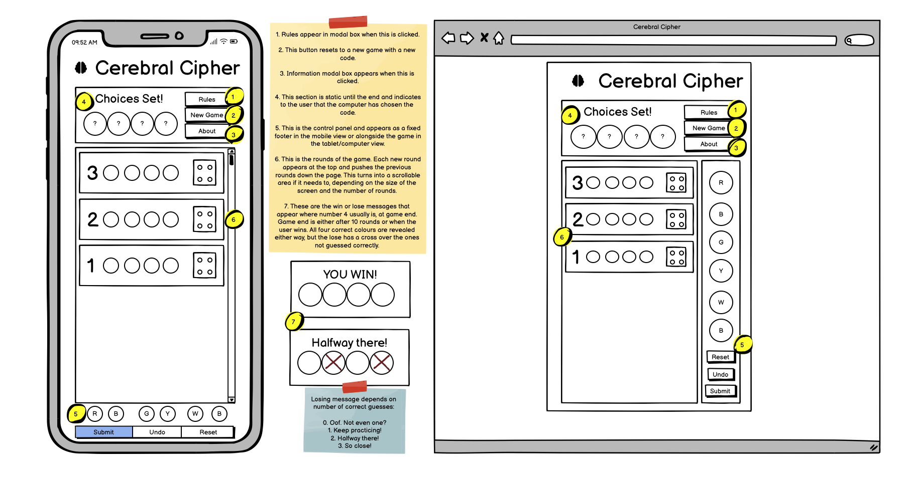

Changes were made to the elements and design as development progressed. For example, I chose to remove the 'About' section because I don't think users have a great deal of interest in who made a simple game, they just want to enjoy playing it. 

### Colour Palette

This game already has 4 bold primary/secondary colours, as well as black and white, as an integral part of the gameplay. I wanted to tone this down slightly so it can appear more stylish and be less harsh on the eyes for those that want to play more than a game or two. Here is what I chose from left to right, top row, then bottom row.  I found more muted versions of those 4 bold primary/secondary colours, chose a nice creamy-beige instead of the white, and chose a very dark grey instead of the black. I then found complementary background and accent colours.

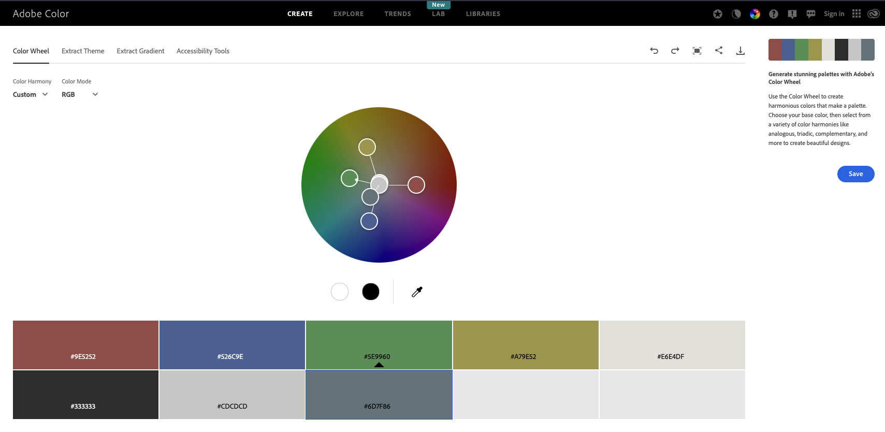

## Features

### Computer Choice Indicator / Game End Message
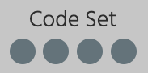

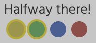

At the start, this section of the screen indicates to the user that the computer has chosen and set the code for this game. When the user has either cracked the code or the 10 round are up, whichever is sooner, this changes to display the end game messaging depending on whether the user has won or if not, how many the user has gotten correct.

### Navigation Section
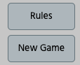

This section contains the 'Rules' and 'New Game' buttons that allow you to read the rules in a pop up, or start a new game respectively. 

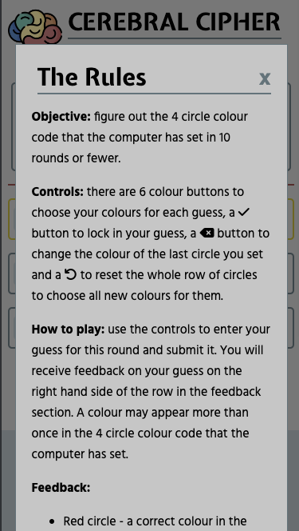

### Game Area
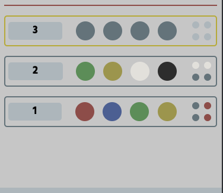

This is where a row for each round is populated with the four circles for the user to colour as a guess, and the feedback on that row when the guess is submitted. The new rows populate from the top, pushing previous rounds down the screen. The top row is also highlighted to reinforce the focus of the user to the current round at the top of the game area. 

### Controls Panel
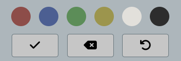

This is where the user can select which colours they would like to populate the current round row with. They can also delete the latest colour chosen or reset the row as many times as they want until they click the submit button to lock in their guess for this round. 

### Features Left to Implement

#### Dark Mode
Although this was designed to be less harsh on the eyes than the original, brighter primary colours utilised in the physical board game, some people may prefer a dark mode. People who want to play a bit before bed without too much light from their screen, or those that have different visual accessibility needs may appreciate a dark mode.

#### Endless Guess Mode
This could be an easier mode for those less capable of completing the game within 10 rounds. Or for new players to practice and get to the answer eventually, following along every stage, before switching to the usual 10-round version of the game. 

## TESTING

I completed the following types of testing throughout development and at the end of my project: 

### Manual Feature Testing

As well as running through the list of user needs and ensuring all the features collectively meet all of the needs, I completed the following manual feature testing: 

| Feature           | Test Case | Expected Outcome | Bugs? |
| ----------------  | -------   | ----    | ----- |
| Code Set/Game End Message | Check the correct message present at game start | "Code Set" present at start | None|
| | Check the correct message shows when the user wins | "YOU WIN!" present when user wins | Bug 7 |
| | Check the correct message shows when the user gets 1, 2 or 3 correct | Relevant message appears if no win after 10 rounds | Bug 7 |
| | Check the circles are highlighted at game end indicating which answers were correct | All circles are highlighted if the user wins. The correct answers the user gave are highlighted if they've guessed at least one correctly | Bug 3
| Navigation Section | Check the "Rules" button works | The rules appear when the button is clicked | None |
| | Check the "New Game" button works | The old game is cleared and a new game starts with a new secret code | None |
| Game Area | Check new rows appear in the game area correctly | A new row appears after the previous one is submitted if the game hasn't ended due to winning or 10 rounds being played| None |
| | Check that the correct feedback is given after submission | The correct feedback is given in the correct row | Bugs 2,4+5|
| Controls Panel | Check colours are populated correctly when clicked | Colours are updated on the current row in the game area, from left to right | None |
| | Check the "Reset" button works correctly | The current row is cleared of all colours, regardless of how many were entered | None |
| | Check the "Undo" button works correctly | The last colour entered into the current row is cleared and the circle goes back to grey | None |
| | Check the "Submit" button works correctly | The current row is locked in and feedback is given but only if 4 colours have been selected. | Bug 1 |
| Error Message | Check the error message appears if submit button is pressed prematurely | If the submit button is clicked and there are less than 4 circles which have their colour selected, a pop up error message appears and the user may not continue with submission | None |

### Browser Compatibility and Screen Size Responsiveness

I viewed the game on each of the three key screen sizes (mobile, tablet and computer), using the devtools, on four of the most popular browsers. I also used the responsive setting to slide the width of the screen from narrow all the way through to wide to check the transition points. 

Pixel references for each of the screen sizes 

|Screen | Pixels |
|-----|-----|
| Mobile - iPhone SE | 375px |
| Tablet - iPad Mini | 768px |
| Computer | 1366px |

| Browser | Screen Size | Appearance | Responsiveness |
|-------|-----|-----|-----|
| Chrome | Mobile | Good  | Good|
| | Tablet | Good | Good |
| | Computer | Bug 6 | Good |
| | Transition Points | Good | Good |
| Firefox | Mobile | Good | Good |
| | Tablet | Good | Good |
| | Computer | Good | Good |
| | Transition Points | Good | Good |
| Safari | Mobile | Issue 1* | Good  |
| | Tablet | Issue 1* | Good  |
| | Computer | Issue 1* | Good |
| | Transition Points | Issue 1* | Good |
| Edge | Mobile | Good | Good |
| | Tablet | Good | Good |
| | Computer | Good | Good |
| | Transition Points | Good | Good |

*Issue 1: it appears there is currently a bug outside my control as [explained here](https://bugs.webkit.org/show_bug.cgi?id=231590) 

#### Key Responsiveness Differences

The game takes up the whole width of the screen in mobile phone and smaller tablet sizes. The footer is fixed and contains the controls in a row for this size. 

In the larger tablets upwards (including laptops and desktop monitors), the game appears in the centre of the screen and the controls are no longer found in the footer, but in a column alongside the main game area. 

The difference between these screen sizes can be seen in screenshots for bugs one (mobile/small tablet) and siz (larger screens).

### Code Validation

This was carried out by both link and direct input on the following tools: 
- HTML via [W3C](https://validator.w3.org/)
- CSS via [Jigsaw](https://jigsaw.w3.org/css-validator/)
- JavaScript via [Linter]()

I completed the validation after resolving all my bugs. 

The CSS...

The HTML needed the following changes: 
1. I had to close one of my `
` elements that I'd forgotten to close.
2. I had to change the headings of my two modal boxes to use a `<h2>` element instead of a `<h1>`
3. I needed to add a non-displaying heading for my main game area section, to inform screen-reader users.

The JavaScript...

### Lighthouse and Accessibility Testing

I used Lighthouse in Chrome Devtools on the single page of my site, using the mobile setting.

After resolving my lighthouse bugs, I reran the report. Here are the new results: 

#### Colour Contrast
I also checked the colour contrast using of my color palette combinations using Coolors: https://coolors.co/contrast-checker/112a46-acc8e5.

#### Alternative Text 

I went through the site systematically, checking that each image had alternative text.

### Resolved Bugs

#### Bug One

**Issue:** 
I believed I had ensured that the user could not click the submit button if they had not chosen four colours to make up their guess. I recalled this worked at the time of coding it but I noticed towards the end of my project, that it had stopped working at some point (or had never worked, I can't be certain) and the user could submit an incomplete row. 

**BEFORE**

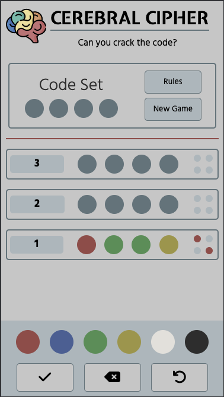

**Fix:** 
In my investigation, I found that the line of code I had intended to perform this check inside the userSubmission function `if (GUESSROW.circles.length === 4) {` wasn't actually going to to achieve the desired outcome. I had to change things so the submit button would be disabled by default and then conditionally enabled. Please see the difference between [this commit before](https://github.com/EvitaKnits/cerebral-cipher/commit/d8690fcfeb51c358c2ff1a60c5cd87e6e7bc58d2) and [this commit after](https://github.com/EvitaKnits/cerebral-cipher/commit/efa6433d3fcad936e2bfc3b39c7b67555854a38f) for the changes I made to achieve this.

**AFTER**

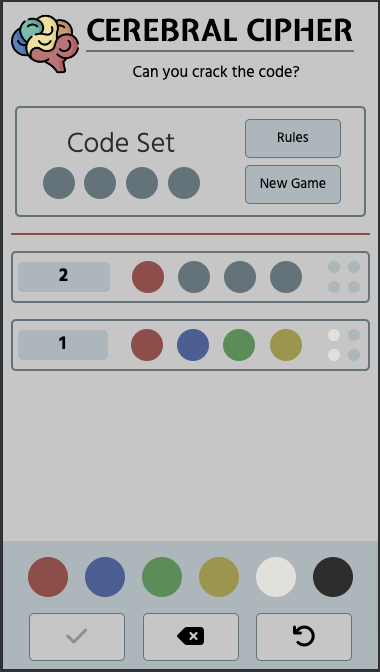

#### Bug Two

**Issue:** 
I had implemented a simple function to check the user's guess submission which I believed provided the correct feedback to the user, adhering to the rules of the game. I saw however that when there were multiple guesses for one correct colour, the feedback would be incorrect. I assessed the submission for each individual guess circle without taking into account the other guess circles which gave me incorrect results. For example: 

Incorrect Behaviour:
- Code set: Yellow Blue Green Black
- Guess: Green Green Green Green
- Feedback: White White Red White

This incorrectly provides the feedback that one of your guess circles is the right colour and in the right place and the other three are the correct colour but in the wrong place. This goes against the rules of the game.

Desired Behaviour:
- Code set: Yellow Blue Green Black
- Guess: Green Green Green Green
- Feedback: Grey Grey Red Grey

This correctly provides the feedback that you have gotten one colour correct and in the right place.

**Fix:**
I made this flowchart to help me visualise what I needed to achieve to fix this bug:

For each code colour circle: 
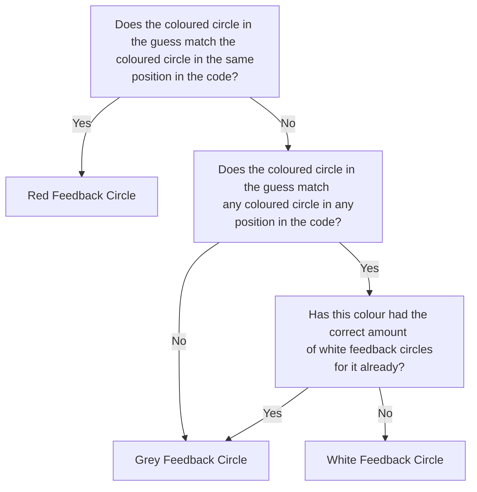

It took me a couple of attempts with different approaches to get there. [This is the original](https://github.com/EvitaKnits/cerebral-cipher/commit/786af15807b1a2951f7f1603180fb00204837c5a) approach taken, but this created the incorrect behaviour shown above. [This commit](https://github.com/EvitaKnits/cerebral-cipher/commit/e8ac4874ec90e734ab946942352ab08a7b8a3407) shows where I tried to create a tracker that was updated each time I provided a piece of feedback for one of the code circles. This didn't always provide the correct feedback either, in the real edge cases where the logic needed to understand whether red feedback circles had been provided for the same colour. It also mattered what order the colours appeared in the feedback function, so this approach would require tracking lots of information to account for each colour's provided feedback and how much feedback should be provided whenever evaluating for a white feedback circle. The final fix and approach can be found in [this commit](https://github.com/EvitaKnits/cerebral-cipher/commit/b2124ebdeee96a54b40029daa0fecf72f16ee201). 

The final approach creates copies of the current game colours and current guess being evaluated and changes the copy of the values after feedback has been provided for them. This means each code circle gets a single feedback circle every time and doesn't confuse the situation where they're being checked multiple times. 

I made one last tweak, to fix my transposition error where I got my guess and game colour array names in the wrong place and therefore used the wrong word indicating this has been dealt with (null instead of done). This can be seen in [this commit](https://github.com/EvitaKnits/cerebral-cipher/commit/5c01cc1b02fc086c10165c61c5d06c8b44cb7605).

#### Bug Three 

**Issue**
When I changed the way the user submission was checked for Bug Two, this changed the way the feedback array was populated with the colours. This meant that the first item in the feedback array did not necessarily apply to the first colour in the code that had been set. This meant that regardless of which circles in the code had been guessed correctly, the number of correct answers would be the number of circles being highlighted but starting with circle one. So in the example below, two of the answers were correct: circles three and four. But circles one and two were highlighted. 

**BEFORE**

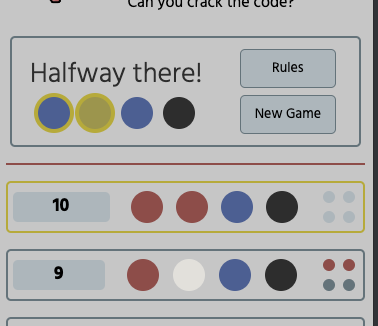

**Fix**
Instead of using the feedback array to identify which code circles should be highlighted, I just repeated the checks for the red feedback pegs from scratch and pushed the 'glow' class to those circles to highlight them at game end. 

**AFTER**
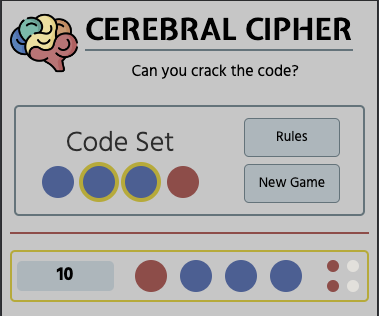

#### Bug Four

**Issue**
My original implementation of assigning the highlight to the correct answers in the final reveal meant that I did not populate the feedback on the 10th round because I had used an if else statement that only provided the feedback if the current round number was less than 10. 

**Fix**
I changed the structure of this code when I was fixing bug three, so this issue was also solved then as a side effect. The if else statement at fault was removed as part of that fix.

The before and after screenshots of bug three also illustrate bug four.

#### Bug Five

**Issue**
This one was quite similar to bug four but this time no feedback was given upon winning, whether that was on the 2nd or the 10th round - it didn't matter which round. 

**BEFORE**
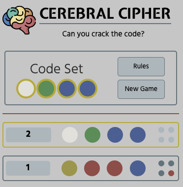

**Fix**
I found that this was because when the checkUserSubmission function found that the user had won, it jumped to the endGame function. If the user does not win, the userSubmission function will then call provideFeedback. If the user does win however, we don't go back to the userSubmission function, just jump to endGame. I added a call to provideFeedback if the user wins, inside the checkUserSubmission function. 

**AFTER**
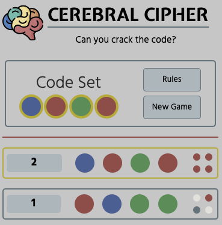

#### Bug Six

**Issue**
In the larger non-touch-screen size, the scrollbar for the game area that contains the rounds, appears white and not the same colour as the background or some other colour from the colour scheme. 

**BEFORE**
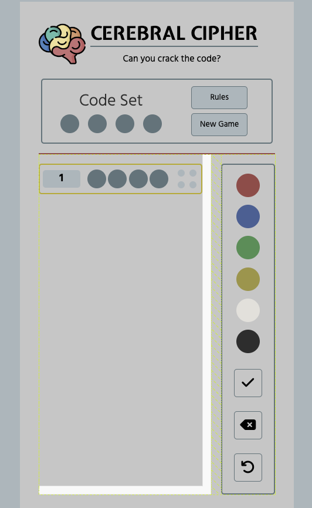

**Fix**
I just had to apply some styling to the scroll bar. I chose to use the same colour as the background to continue the minimalist design I was going for, so the scrollbar will not normally be visible. 

**AFTER**
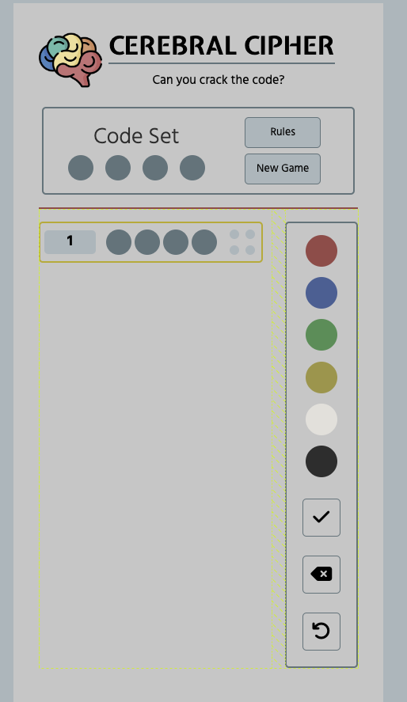

#### Bug Seven

**Issue**
The message accompanying the game end was not working correctly, remaining as it is at the start of the game: "Code Set"

**BEFORE**
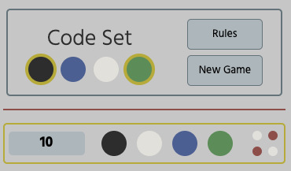

**Fix**
I saw that this was because part of my endGame function was clearing the GUESSROW.feedback array that the function was using to select the correct message to provide at game end. I therefore moved the part of the function that assigned the message to before this array is cleared, thus the message is selected first and everything now works as expected. 

**AFTER**
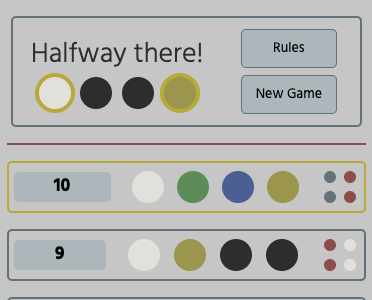

### Unresolved Bugs

I don't believe I have left any of my bugs unresolved.

## DEPLOYMENT

The site was deployed to GitHub pages. 

The steps to deploy are as follows:
- In the GitHub repository, navigate to the Settings tab
- Under 'Code and automation' in the left hand menu, click on 'Pages'
- Make sure the 'Source' and 'Branch' fields are set to 'Deploy from branch' and 'Main' respectively.
- Click save. 
- If the page does not automatically refresh, manually refresh it and at the top there should be a box that states 'Your site is live at' followed by the URL. 

The live link can be found here:

## CREDITS

### Content
I used this rulebook for the original Mastermind game: https://www.pressmantoy.com/wp-content/uploads/2018/07/3018K10_v1_0218_Mastermind_IM.pdf
I used this website to lighten #6D7F86 from my colour scheme to use as my background colour on the largest screen size: https://mdigi.tools/lighten-color/#6d7f86
I used this website to saturate #A79E52 from my colour scheme to use as my border colour for the current guess row to highlight it: https://mdigi.tools/saturate-color/#a79e52 

**Favicon**
I got my icon from here: https://www.flaticon.com/free-icon/brain_3286097?term=brain&page=1&position=22&origin=search&related_id=3286097
I generated the code to paste in the head of my HTML file here: https://realfavicongenerator.net/

### Sources of Learning
I learnt how to add flowcharts to my README with Mermaid here: https://mermaid.js.org/intro/ and https://mermaid.js.org/syntax/flowchart.html
I learnt how to make a fixed footer here: https://www.w3schools.com/howto/howto_css_fixed_footer.asp
I learnt how to desaturate an image with CSS here: https://developer.mozilla.org/en-US/docs/Web/CSS/filter-function/saturate
I learnt/reminded myself about how to use last-child here: https://developer.mozilla.org/en-US/docs/Web/CSS/:last-child
I learnt how to make a modal box here: https://www.w3schools.com/howto/howto_css_modals.asp
I learnt how to get a number between 1 and 6 here: https://developer.mozilla.org/en-US/docs/Web/JavaScript/Reference/Global_Objects/Math/random 
I learnt how to refresh the page when you click a button here: https://sentry.io/answers/how-do-i-refresh-a-page-using-javascript/ 
I learnt how to use event delegation here: https://byby.dev/js-add-event-listener
I learnt how to disable buttons with JavaScript here: https://www.altcademy.com/blog/how-to-disable-a-button-in-javascript/
I learnt about pointer events via tutoring and this link: https://www.w3schools.com/csSref/css3_pr_pointer-events.php 
I learnt how to do the Fisher Yates Method of shuffling an array here: https://www.w3schools.com/js/js_array_sort.asp 
I learnt how to check if all array elements pass a test here: https://www.javascripttutorial.net/javascript-every/
I learnt how to use indexOf here: https://www.w3schools.com/jsref/jsref_indexof.asp

### General Credit
I want to thank the open source community for the great resources that remind me of what I learnt in my Code Institute lessons, especially https://www.w3schools.com/ and https://developer.mozilla.org/en-US/

I believe I have specifically credited where I used specific items in the previous section but this is a general credit to the reference resources I looked through to remind me how things worked as I went along.  

Every effort has been made to credit everything used but if I find anything else specific later on that needs crediting, that I missed, I will add it. 